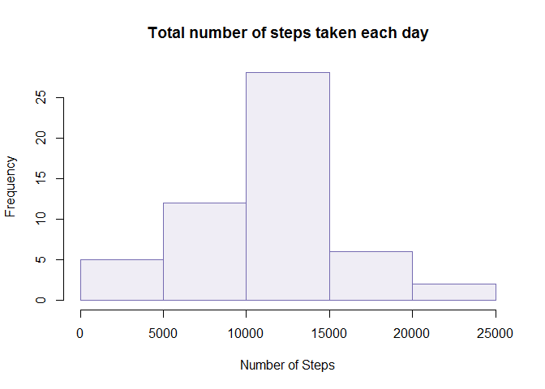
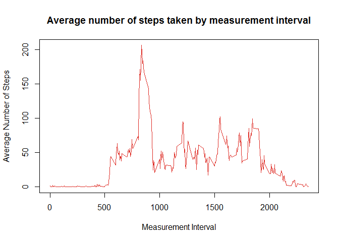
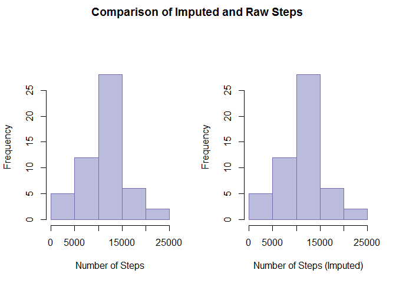
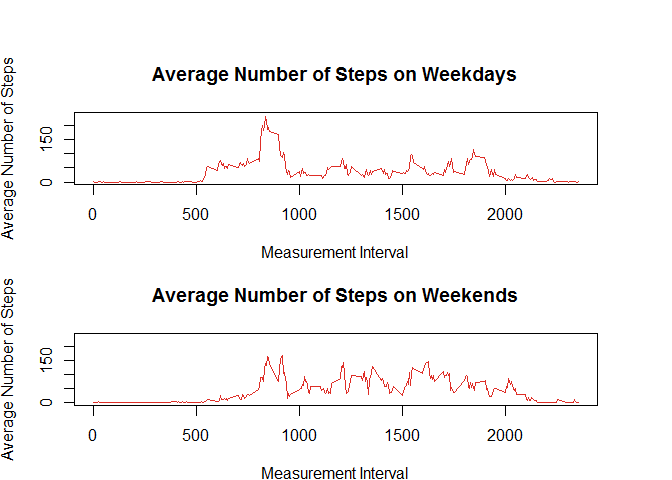

# Reproducible Research: Peer Assessment 1
J. Campbell  
April 20, 2016  


## Loading and preprocessing the data
#### Load the data

```r
act<-read.csv("C:/Users/Dell - User/Desktop/jhu_data_sci/repdata-data-activity/activity.csv")
```

#### Create date field formatted as date

```r
act$date2<-as.Date(act$date,'%Y-%m-%d')
```

## What is mean total number of steps taken per day?
#### Calculate the total number of steps taken per day

```r
daysteps<-aggregate(act$steps,list(act$date),sum)
names(daysteps)<-c("Date","Steps")
library(knitr)
```

```
## Warning: package 'knitr' was built under R version 3.2.5
```

```r
kable(daysteps,format="pandoc",format.args=list(big.mark=","),results="asis")
```


Date           Steps
-----------  -------
2012-10-01        NA
2012-10-02       126
2012-10-03    11,352
2012-10-04    12,116
2012-10-05    13,294
2012-10-06    15,420
2012-10-07    11,015
2012-10-08        NA
2012-10-09    12,811
2012-10-10     9,900
2012-10-11    10,304
2012-10-12    17,382
2012-10-13    12,426
2012-10-14    15,098
2012-10-15    10,139
2012-10-16    15,084
2012-10-17    13,452
2012-10-18    10,056
2012-10-19    11,829
2012-10-20    10,395
2012-10-21     8,821
2012-10-22    13,460
2012-10-23     8,918
2012-10-24     8,355
2012-10-25     2,492
2012-10-26     6,778
2012-10-27    10,119
2012-10-28    11,458
2012-10-29     5,018
2012-10-30     9,819
2012-10-31    15,414
2012-11-01        NA
2012-11-02    10,600
2012-11-03    10,571
2012-11-04        NA
2012-11-05    10,439
2012-11-06     8,334
2012-11-07    12,883
2012-11-08     3,219
2012-11-09        NA
2012-11-10        NA
2012-11-11    12,608
2012-11-12    10,765
2012-11-13     7,336
2012-11-14        NA
2012-11-15        41
2012-11-16     5,441
2012-11-17    14,339
2012-11-18    15,110
2012-11-19     8,841
2012-11-20     4,472
2012-11-21    12,787
2012-11-22    20,427
2012-11-23    21,194
2012-11-24    14,478
2012-11-25    11,834
2012-11-26    11,162
2012-11-27    13,646
2012-11-28    10,183
2012-11-29     7,047
2012-11-30        NA

#### Make a histogram of the total number of steps taken each day

```r
hist(daysteps$Steps,col='#efedf5',border='#756bb1',main='Total number of steps taken each day',xlab='Number of Steps')
```



#### Calculate and report the mean and median of the total number of steps taken per day

```r
options(scipen=1,decimals=2)
mean(daysteps$Steps,na.rm=TRUE)
```

```
## [1] 10766.19
```

```r
median(daysteps$Steps,na.rm=TRUE)
```

```
## [1] 10765
```

The mean number of steps taken per day is 10766.19. The median number of steps taken per day is 10765. The values are very close mirroring the nice symmetric histogram in the plot above.

## What is the average daily activity pattern?
#### Time series plot (i.e. type = "l") of the 5-minute interval (x-axis) and the average number of steps taken, averaged across all days (y-axis)

```r
intsteps<-aggregate(act$steps,list(act$interval),mean,na.rm=TRUE)
names(intsteps)<-c("Interval", "Avg_Steps")
plot(intsteps$Interval,intsteps$Avg_Steps,type='l',col='#de2d26',main='Average number of steps taken by measurement interval',xlab='Measurement Interval',ylab='Average Number of Steps')
```



#### Which 5-minute interval, on average across all the days in the dataset, contains the maximum number of steps?

```r
mx<-intsteps[which(intsteps$Avg_Steps==max(intsteps$Avg_Steps)),]
intsteps[which(intsteps$Avg_Steps==max(intsteps$Avg_Steps)),]
```

```
##     Interval Avg_Steps
## 104      835  206.1698
```

The interval 835 has an average of 206.1698113. We can see the spike at this interval on the time plot above.

## Imputing missing values
Note that there are a number of days/intervals where there are missing values (coded as NA). The presence of missing days may introduce bias into some calculations or summaries of the data.

#### Calculate and report the total number of missing values in the dataset (i.e. the total number of rows with NAs)

```r
sum(is.na(act$steps))
```

```
## [1] 2304
```

```r
(sum(is.na(act$steps))/nrow(act))*100
```

```
## [1] 13.11475
```

There are 2304 missing values accounting for approximately 
13.11 percent of the data set.

#### Devise a strategy for filling in all of the missing values in the dataset. Use the mean for that 5-minute interval.
#### Create a new dataset that is equal to the original dataset but with the missing data filled in.

```r
imputesteps<-merge(act,intsteps,by.x="interval",by.y="Interval")
imputesteps$i_steps<-ifelse(is.na(imputesteps$steps),imputesteps$Avg_Steps,imputesteps$steps)
```
#### Make a histogram of the total number of steps taken each day and Calculate and report the mean and median total number of steps taken per day. 

```r
summary(imputesteps$i_steps)
```

```
##    Min. 1st Qu.  Median    Mean 3rd Qu.    Max. 
##    0.00    0.00    0.00   37.38   27.00  806.00
```

```r
summary(imputesteps$steps)
```

```
##    Min. 1st Qu.  Median    Mean 3rd Qu.    Max.    NA's 
##    0.00    0.00    0.00   37.38   12.00  806.00    2304
```

```r
sumimpute<-aggregate(cbind(steps,i_steps)~date,data=imputesteps,sum)
par(mfrow=c(1,2),oma=c(0,0,2,0))
hist(sumimpute$steps,col='#bcbddc', border='#756bb1',xlab='Number of Steps',main='')
hist(sumimpute$i_steps,col='#bcbddc', border='#756bb1',xlab='Number of Steps (Imputed)',main='')
title("Comparison of Imputed and Raw Steps",outer=TRUE)
```



```r
mean(sumimpute$steps)
```

```
## [1] 10766.19
```

```r
mean(sumimpute$i_steps)
```

```
## [1] 10766.19
```

```r
median(sumimpute$steps)
```

```
## [1] 10765
```

```r
median(sumimpute$i_steps)
```

```
## [1] 10765
```

#### Do these values differ from the estimates from the first part of the assignment? 
The estimates produced by imputing the steps are similar to the estimates produced by the raw steps. The means and medians by day are identical.

```r
mean(sumimpute$steps)
```

```
## [1] 10766.19
```

```r
mean(sumimpute$i_steps)
```

```
## [1] 10766.19
```

```r
median(sumimpute$steps)
```

```
## [1] 10765
```

```r
median(sumimpute$i_steps)
```

```
## [1] 10765
```

#### What is the impact of imputing missing data on the estimates of the total daily number of steps?
There looks to be little or no impact of imputing missing data on the estimates of the total daily number of steps. The distributions of the side-by-side histograms look very similar. Likewise, the estimates of central tendancy are identical.


## Are there differences in activity patterns between weekdays and weekends?
#### Create a new factor variable in the dataset with two levels - "weekday" and "weekend" indicating whether a given date is a weekday or weekend day.

```r
imputesteps$weekend<-ifelse(weekdays(imputesteps$date2,abbreviate=TRUE) %in% c("Fri","Mon","Thu","Tue","Wed"),"Weekday","Weekend")
```

#### Make a panel plot containing a time series plot (i.e. type = "l") of the 5-minute interval (x-axis) and the average number of steps taken, averaged across all weekday days or weekend days (y-axis). 


```r
intimpsteps<-aggregate(imputesteps$i_steps,list(imputesteps$interval,imputesteps$weekend),mean,na.rm=TRUE)
names(intimpsteps)<-c("Interval","Weekday","Avg_Steps")
xg<-split(intimpsteps,intimpsteps$Weekday)
weekday<-as.data.frame(xg$Weekday)
weekend<-as.data.frame(xg$Weekend)
par(mfrow=c(2,1),oma=c(0,0,2,0),pin=c(5.45,0.75))
plot(weekday$Interval,weekday$Avg_Steps,type='l',col='#de2d26',main='Average Number of Steps on Weekdays',xlab='Measurement Interval',ylab='Average Number of Steps',ylim=c(0,235))
plot(weekend$Interval,weekend$Avg_Steps,type='l',col='#de2d26',main='Average Number of Steps on Weekends',xlab='Measurement Interval',ylab='Average Number of Steps',ylim=c(0,235))
```


